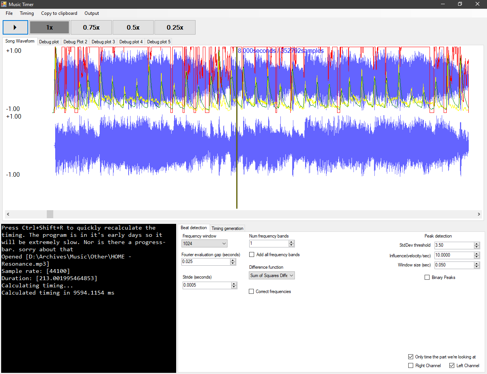

# Song BPM Calculator
Specifically designed for timing multi-bpm songs for rhythm games like osu!

A multi-bpm song is a song that has many BPM changes, and rhythm game chart makers almost never make charts for these songs because they require a large amount of effort to manually specify all of these timing changes before a chart can even be made. Not to mention that the uneven timings make the song much harder to get good accuracy on, which may also deter some players from playing the chart. There are almost no upsides other than the song itself.

## Note: The program doesn't work yet

As you can see by the screenshot below, the peak detection algorithm kinda sorta works but it is super inconsistent from song to song, and requires a bunch of fine tuning. There are several situations where it works terribly. And even in instances where it works quite well, I haven't been able to figure out a way to fit timing points to the peaks. Probably needs some sort of linear regression algorithm + backtracking (way easier to suggest in a README than to implement). It is also a lot slower than I would like. The algorithm may very well be completely wrong.

I have basically abandoned this project, because it was taking me way to long to iterate on the algorithm. Really, the thing I should have done if I knew better was to start generating the UI using reflection or source-code generators, so I can quickly make changes to the algorithm and get to something that works much better. I may come back to this later, but there is a relatively low chance because I don't play the game(s) that motivated this project anymore.

## How to build:

1. Open solution with Visual Studio
2. Press "Start"

If everything went well, and you were able to open some music, you should see this:

